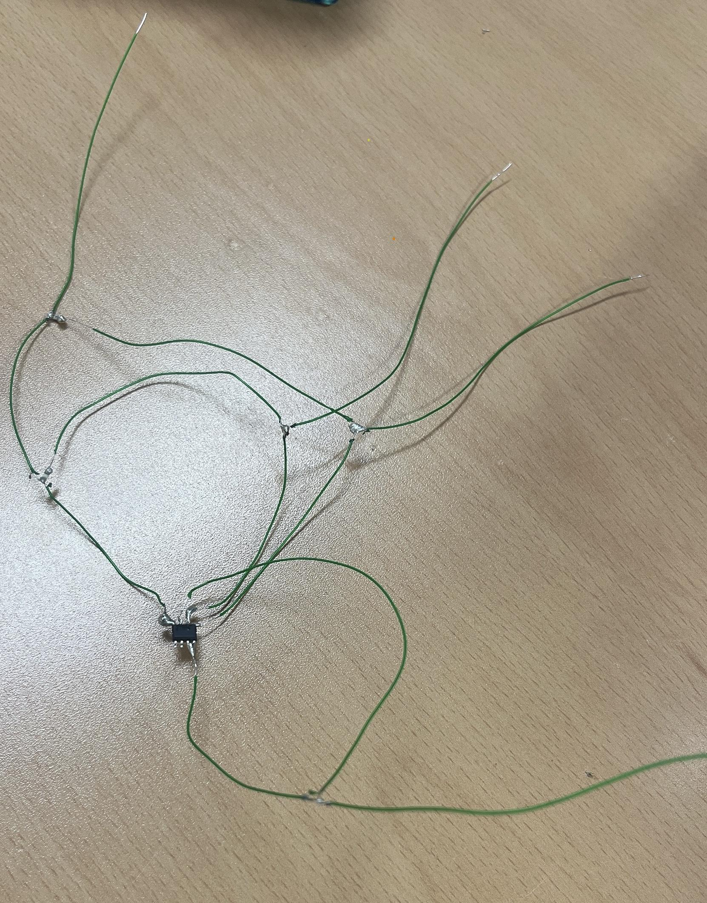

# I2C Interface

## Contents

- [I2C Interface](#i2c-interface)
  - [Contents](#contents)
  - [Hardware](#hardware)
  - [EEPROM 제작](#eeprom-제작)
  - [Data write](#data-write)
    - [Image](#image)
    - [Write data](#write-data)
    - [Byte write](#byte-write)
    - [Page write](#page-write)
  - [Data read](#data-read)
    - [Image](#image-1)
    - [Read data](#read-data)
    - [Byte read](#byte-read)
    - [Page read](#page-read)
  - [Address setup](#address-setup)
    - [Device address](#device-address)
    - [Address setup](#address-setup-1)
  - [Response](#response)
    - [Send response](#send-response)
    - [Receive response](#receive-response)
  - [Test image](#test-image)

## Hardware

- 8bit AVR core (ATmega128)
- EEPROM

## EEPROM 제작



## Data write

### Image

### Write data

```C
void write_data(uint8_t data)
{
	uint8_t i;
	uint8_t data_buffer = data;

	DATA_OUT;

	for (i = 0; i < 7; ++i)
	{
		if (GET_BIT(data_buffer, i) == 0x80) { DATA_HIGH; }
		else  { DATA_LOW; }
		_delay_us(3);
		CLK_HIGH;
		_delay_us(5);
		CLK_LOW;
		_delay_us(5);
	}

	if (((data_buffer << i) & 0x80) == 0x80) DATA_HIGH;
	else DATA_LOW;

	_delay_us(3);
	CLK_HIGH;
	_delay_us(5);
	CLK_LOW;
	_delay_us(5);
}
```

### Byte write

```C
void i2c_byte_write(uint8_t data)
{
	write_data(data);
	response = receive_response();
}
```

### Page write

```C
void i2c_page_write(const uint8_t page[], uint8_t page_size)
{
	uint8_t data_index;
	uint8_t data_buffer = 0x00;

	for (data_index = 0; data_index < page_size; ++data_index)
	{
		data_buffer = page[data_index];

		write_data(data_buffer);

		response = receive_response();
	}
}
```

## Data read

### Image

### Read data

```C
uint8_t read_data(void)
{
	uint8_t data_buffer = 0x00;
	uint8_t i;

	DATA_IN;

	for (i = 0; i < 8; ++i)
	{
		loading_led();
		CLK_HIGH;
		_delay_us(10);
		CLK_LOW;
		data_buffer |= ((PIND >> 1) & 0x01);
		if (i != 7)
		{
			data_buffer <<= 1;
		}
		_delay_us(3);
	}

	return data_buffer;
}
```

### Byte read

```C
void i2c_byte_read(void)
{
	uint8_t data_buffer;

	data_buffer = read_data();

	send_response(NOACK);
}
```

### Page read

```C
void i2c_page_read(uint8_t page_size)
{
	uint8_t data_index;
	uint8_t data_buffer = 0x00;

	for (data_index = 0; data_index < page_size; ++data_index)
	{
		data_buffer = read_data();
		page_buffer[data_index] = data_buffer;

		send_response(ACK);
	}

	send_response(NOACK);
}
```

## Address setup

### Device address

```C
void i2c_device_address_setup(uint8_t device_id, uint16_t target_address, uint8_t rw)
{
	uint8_t device_address = 0x00;

	if (((target_address >> 9) & 0x0001) == 0x0001)
		SET_A9(device_address);
	else if (((target_address >> 8) & 0x0001) == 0x0001)
		SET_A8(device_address);

	device_address |= rw;
	device_address |= device_id;

	write_data(device_address);

	response = receive_response();

	if (response == NOACK) { i2c_stop(); }
}
```

### Address setup

```C
void i2c_address_setup(uint16_t target_address)
{
	uint8_t address = (uint8_t)target_address;

	write_data(address);

	response = receive_response();

	if (response == NOACK) { i2c_stop(); }
}
```

## Response

### Send response

```C
uint8_t receive_response(void)
{
	uint8_t t;

	DATA_IN;
	CLK_HIGH;

	for (t = 0; t < 20; ++t)
	{
		if ((PIND & 0x02) == ACK)
		{
			_delay_us(6);
			CLK_LOW;
			DATA_OUT;
			_delay_us(6);
			return ACK;
		}
	}

	_delay_us(6);
	CLK_LOW;
	DATA_OUT;
	_delay_us(6);

	return NOACK;
}
```

### Receive response

```C
void send_response(uint8_t data)
{
	DATA_OUT;

	if (data == ACK)
		SEND_ACK;
	else if (data == NOACK)
		SEND_NOACK;

	_delay_us(3);
	CLK_HIGH;
	_delay_us(5);
	CLK_LOW;
	_delay_us(5);
}
```

## Test image
