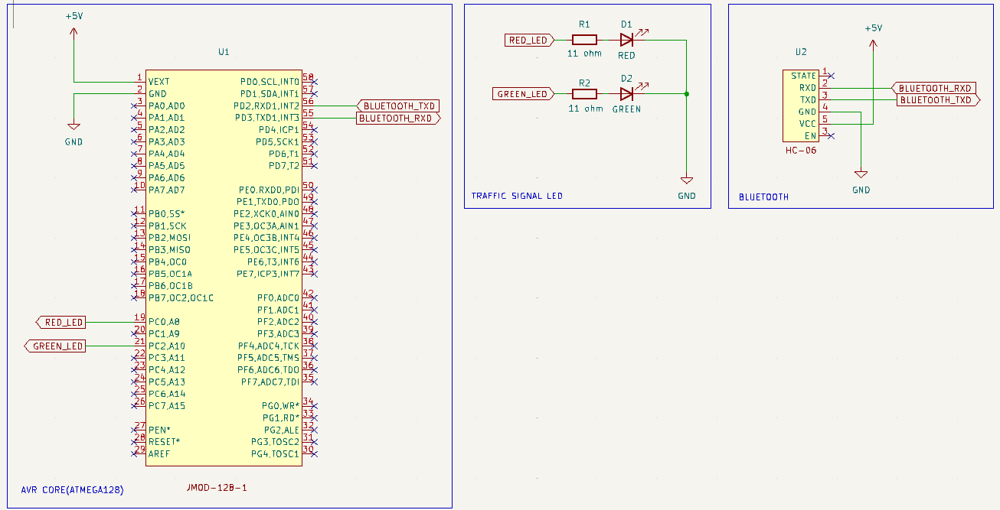

# Traffic signal project

## Contents

- [Hardware](#hardware)
- [Schematic](#schematic)
- [High level design](#high-level-design)
- [Class diagram](#class-diagram)
- [Flow chart](#flow-chart)
- [Image](#image)

## Hardware

- AVR Core (ATmega128)
- Bluetooth module (HC-06)
- Red LED, Green LED

## Schematic

## High level design

## Class diagram

## Flow chart

## Image

